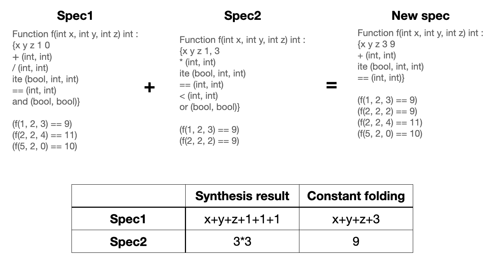

# genetic synthesis

## What is the topic?
My topic is to find the best specification for the program synthesis problem. Program synthesis is the task of discovering an executable program from user intent expressed in the form of specification. this specification consists of in/output examples and syntactic restrictions. I wonder if the use of genetic algorithms can search for the best combination of in/output examples and syntactic restrictions.

## Justification of why you have chosen your topic.
The program synthesizer I use in this project is Eusolver, which takes in/output examples and syntactic restrictions, and finds a program that satisfies the specification. Eusolver uses an enumerative approach that gradually increases the program size of candidate solutions one by one. These candidates are program combinations that satisfy a given grammar and the candidate program size. If a candidate solution meets all in/output examples, then Eusolver returns the solution. Otherwise, Eusolver increases the candidate program size.  

Here is an example of the synthesis problem. The target program f(x, y) = 10 \* x + y, the set of syntactic restrictions {x, y, 1, +, \*}, and the set of in/output examples {{f(1,1)=11}, {f(1,10)=11}, {f(2,2)=22}}. The candidate programs of the size 1 are f(x,y)=x, f(x,y)=y, and f(x,y)=1. These are not satisfied with the examples, so Eusolver increases the candidate program size to 3. Then x+y, x\*y, x+1 ... are generated. But the problem is that only the constant '1' can be used because of the grammer. Eusolver reluctantly generates f(x,y)=(1+1+...+1) \* x + y, which has a long code size and takes a long time to find.  

As the candidate program size increases, the number of generated candidates increases exponentially. If constant '10' was in the grammar, the more efficient program could be synthesized quickly. However, finding the needed constant is a difficult task if the target program code is not public, and you can only use the log data of the target program. The same thing is applied to the parameters and operators. This is why I'm doing this project. I want to find the best combination of parameters, operations, and constants. This is already the NP problem even though it's not combined with selecting the in/output examples due to a combination of numerous constants.  

Now moving on to the in/output example combinations, It is also the NP problem because a portion of in/output examples are selected from all possible examples. This also means that the larger the input range, the greater the number of combinations will increase. If the number of examples is too small, then the synthesized program will be too different from the target program. On the contrary, if the number of examples is too large, then it will take a very long time to synthesize. After all, the goal is to synthesize programs that can be synthesized within a given time, have high accuracy, and (hopely) have small code sizes.  

## Design decision explaining why you select:
### Parameters such as the size of an initial population.
The size of initial population: (the number of available processors) * 2.  
Timeout for synthesizing each program (individual): given by user.

### Stopping criteria.
It stops if the 100% accuracy is acheived or total execution timeout (within a hour) is exceeded.

### Fitness function.
The accuracy of each synthesized program (individual) is evaluated by executing 1,000 in/output tests.

### Selection operator.
I will use the tournament selection method.

### Crossover operator.
Before crossover, we need to collect operators and constants used in the actual synthesized program, not in the specification. In addition, a simple constant folding is also applied (ex. from 1 + 1 + 1 to 3). In this case, the constant '3' is actually used, and if '+' and '1' are not used elsewhere, '+' and '1' are excluded in the child. Then the child only has the union of actually used parts between its parents. That is the crossover operation of syntactic restrictions. The crossover operator of in/output examples is just the union of in/output examples in its parents.


By default, the fixed grammar parts are all parameters, '1', 'ite (if-then-else)', and '=='.  
This operation can be applied to the only top 25% of the population.

### Mutation operator.
The Mutation operator can be applied to the only individuals newly generated by the crossover operator.  
There are adding/deleting input-output examples and adding/deleting grammars. These operators are randomly performed independently with a 25% probability.  
adding in/output examples: `examples.addAll(rand(size/2));`.  
deleting in/output examples: `if(size > 10) examples.removeAll(rand(size/2));`.  
adding grammars: `for(operator : operators) if(25%) grammars.add(operator);` and `if(12.5%) grammars.add(rand(100) - 1);` (-1 ~ 98 constant value).  
deleting in/output examples: `for(grammar : grammars) if(12.5%) removeList.add(grammar); grammars.removeAll(removeList);`.

### Generational selection strategy.
All individuals are sorted in the order of high scores in the fitness function, and only the number of the initial population is selected as the next population.

## How to compile and execute:
### Compilation.
You need to compile Eusolver and Z3 (a SMT solver used by Eusolver). If you already have Z3, then change the value `HAVE_Z3=yes` in `eusolver/scripts/build.sh`.
```
cd eusolver/scripts
./build.sh
cd ..
cd ..
./compile.sh
```
### Execution.
```
java -cp ./class synth.SynthMain [log_file] [test_file] [timeout_per_synthesis]
```
